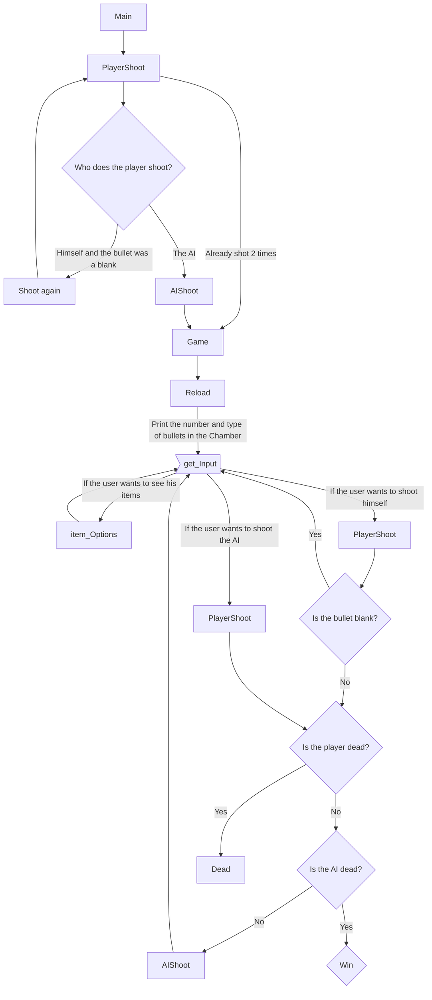

# Main Objective
As stated in the russianRoullete-Game.py file, the objective for this project was to use what I learned in the first semester in Python to create a simple yet interesting game that is meant to be played on the terminal (since I am unable to create front-end at the time of making this project).
During the creation of this project I came across [Buckshot Roulette by Mikie Klubnika](https://mikeklubnika.itch.io/buckshot-roulette) and thought that it would be interesting for me to try to recreate the core gameplay loop seen in that game, in python. Note that even tho the game was inspired by Buckshot Roulette, the entire code is original and written entirely by me.


## The Coding process:
**Note that this is still a work in progress**
### Core mechanics:
As stated before the focus is to create a game that resembles the russian roulette where the player can play against an "AI" that is in fact just an algorithm that works based on the odds of success.
Therefore the main mechanics are:
* Shooting:
  - You can pick to either shoot yourself or the opponent.
  - Just like in Buckshot Roulette if you pick to shoot yourself and it is a blank you get to shoot again.
  - Shooting or getting shot decreases the life of whoever got shot.
  - To pick if the next bullet is real or blank, the weapon is represented as a list of booleans where _False_ represents a blank and _True_ represents a real bullet, then using .pop at a random index getting a random bullet
* Reloading:
  - Everytime the gun runs out of bullets, it reloads randomly adding another bullet, but making sure there is always at least 1 blank and 1 real bullet.
    - This is achieved using random.randint
### The "AI":
As stated before the "AI" is nothing more than an algorithm that calculates odds based on knowledge that the player can also obtain it only counts the amount of blanks and real bullets and then calculates the odd of the next bullet being real.
If the odd is 0.5 or above it chooses to shoot the player, else it chooses to shoot himself.
After implementing powers the odds might change.
### Current graph representing the program working:

# Development Roadmap
## Version 1.0
1. Added Core Mechanics 
2. Created simple algorithm that simulates the "AI"
3. Added the option to select how many lives the player wants (Might remove it later)
## Version 1.1
1. Fixed some edge-cases
2. Improved outputs to better understand what is happening
## Version 1.2
1. Improved input checking([@Helder Oliveira](https://github.com/hgoncalo))
2. Created a new function to optimize input gathering
3. Developed some functions to setup item functions for future updates
4. Fixed bug related to who plays when AI was 1 HP
5. Removed the raise exception when there was a wrong input, now you don't need to restart the entire game
6. Remade the game function so that everytime the weapon reloads tu turn remains the same instead of it being always the player's turn (that was unfair)
## Development Objectives
- [x] Creating Main mechanics
- [x] Fixing outputs
- [X] Improving inputs
- [ ] Improving "AI"
- [ ] Adding powers
- [ ] Creating levels
# How to run:
> [!IMPORTANT]
> Make sure you have git and python3 instaled before following the next steps otherwise the game won't run
Running this commands will create a folder with the entire repository on your device, if do not wish to copy the entirety of the repository you can either follow this steps and delete the extra files or go to the webpage of this repository and download the specific file(s) you wish to run.

Execute the following commands in your terminal:
```
git clone https://github.com/HugoNogueira05/FEUP-Projects.git
```
Using "cd directoryName" reach the directory that was created when you cloned the repository
If you didnt change the path, the commands should be:
```
cd documents
cd GitHub
cd FEUP-Projects
cd Python
```
After that, just write:
```
python RussianRoulette.py
```
# Development Participants:
* Me (everything without the respective tag)
* [@Helder Oliveira](https://github.com/hgoncalo)
